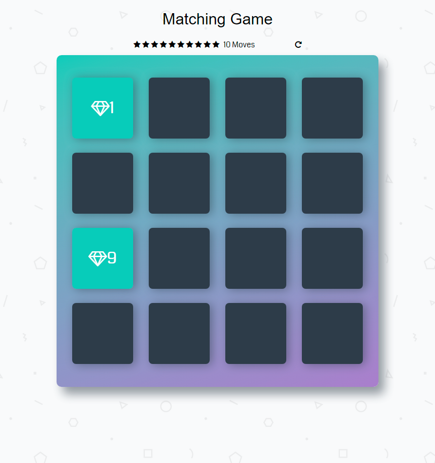

# Udacity Memory Game Project
Memory Game is a browser-based card matching game.

# How The Game Works
The game board consists of sixteen "cards" arranged in a grid. The deck is made up of eight different pairs of cards, each with different symbols on one side. The cards are arranged randomly on the grid with the symbol face down. The gameplay rules are very simple: flip over two hidden cards at a time to locate the ones that match!

Each turn:

The player flips one card over to reveal its underlying symbol.
The player then turns over a second card, trying to find the corresponding card with the same symbol.
If the cards match, both cards stay flipped over.
If the cards do not match, both cards are flipped face down.
The game ends once all cards have been correctly matched.

## Screenshot of the page

# External Resources Used
- [HTML Style Guide](http://udacity.github.io/frontend-nanodegree-styleguide/index.html)
- [CSS Style Guide](http://udacity.github.io/frontend-nanodegree-styleguide/css.html)
- [JavaScript Style Guide](http://udacity.github.io/frontend-nanodegree-styleguide/javascript.html)
- [Git Style Guide](https://udacity.github.io/git-styleguide/)
- [Google Fonts](https://fonts.google.com/)
-  CSS Animations: [animate.css](https://daneden.github.io/animate.css/)
